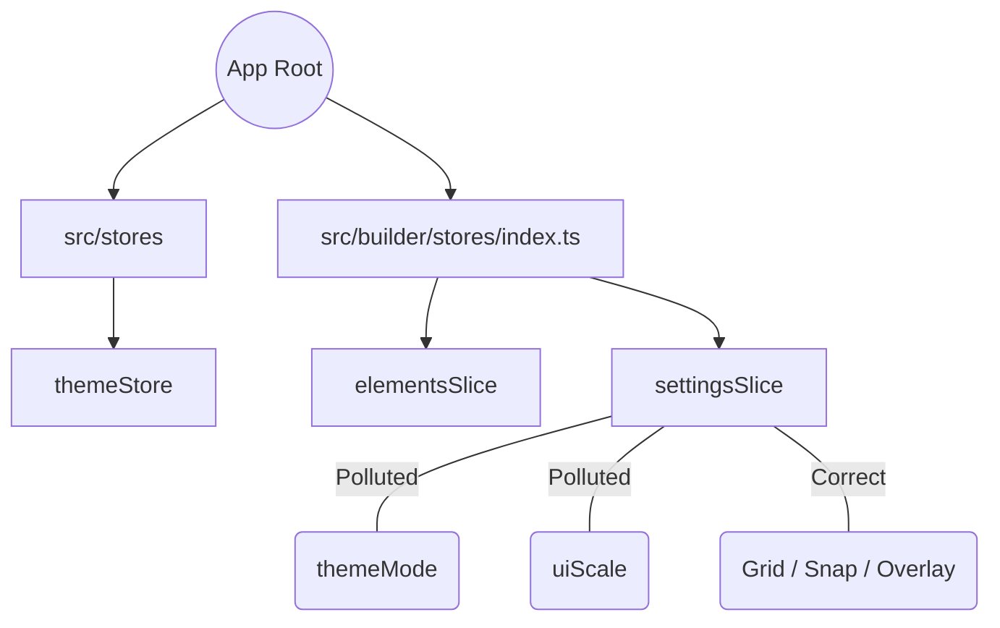

# xstudio Store 구조 최적화 계획

---

## 1. 현 구조 진단 (As-Is Diagnosis)

리팩토링의 근거가 되는 현재 시스템의 구조적 결함 분석 결과입니다.

### 📊 As-Is vs To-Be 비교
| 항목 | 현재 (As-Is) | 목표 (To-Be) | 진단 |
| :--- | :--- | :--- | :--- |
| **uiStore** | 미존재 | **To-Be**: `src/stores/uiStore.ts` 신설 | **필수**: 글로벌 설정 격리 필요 |
| **빌더 설정** | **As-Is**: `settings.ts` (명칭 모호) | **To-Be**: `src/builder/stores/canvasSettings.ts` | **개선**: 책임 범위 명확화 |
| **디렉토리** | `src/builder/stores` | `src/builder/stores` (유지) | **유지**: 기존 구조 보존 |
| **테마 스토어** | 단일 거대 파일 (736줄) | Store / Actions / Selectors 분할 | **Future Work**: Phase 1-4 이후 진행 |

### ⚠️ 주요 오염 필드 (Polluted Fields)
`src/builder/stores/settings.ts` 파일 내에 엔진 도메인이 아닌 필드가 혼재되어 있습니다:
- **글로벌 필드**: `themeMode`, `uiScale` → `uiStore`로 이관 대상
- **엔진 필드**: `showGrid`, `snapToGrid`, `showOverlay` → `canvasSettings` 잔류 대상

---

## 2. 개요

시스템 개요

본 시스템은 **5,000개 이상의 요소를 WebGL로 처리하는 대규모 엔터프라이즈 CMS 빌더**입니다. 대량의 데이터를 지연 없이 렌더링하고, 수만 줄의 히스토리 로그를 메모리 부하 없이 관리하기 위해 설계되었습니다.

---

## 3. 아키텍처 핵심 설계 원칙

### 🚀 O(1) 성능 지향 (High-Performance Engine)

- **Fast Lookup**: 모든 요소는 `Map<string, Element>`를 통해 상수 시간 내에 접근합니다.
- **Indexing System**: `PageElementIndex`를 통해 특정 페이지의 모든 요소를 즉시 필터링(O(1))하며, `_rebuildIndexes`를 통해 원자성을 유지합니다.
- **Selection Optimization**: `selectedElementIdsSet` (Set)을 사용하여 수천 개의 요소 중 선택 여부를 즉시 판별합니다.

### 📦 메모리 관리 및 확장성 (Enterprise Scalability)

- **Lazy Loading with LRU**: 전체 5,000개 요소를 한 번에 메모리에 올리지 않습니다. `ElementLoader`가 LRU(Least Recently Used) 알고리즘을 사용하여 현재 + 최근 5페이지만 메모리에 유지(Cold/Hot 캐시 전략)합니다.
- **Diff-based History**: 전체 상태 스냅샷 대신 `PropsDiff` 시스템을 사용하여 히스토리 당 메모리 사용량을 80~90% 절감합니다.
- **IndexedDB Persistence**: 대규모 히스토리 스택은 IndexedDB에 분산 저장하여 메모리 누수를 방지하고 세션 복구 기능을 지원합니다.

### 🎨 도메인 분리 (Domain Isolation)

- **Global UI Store**: 테마(Mode), 스케일(Scale) 등 전역 사용자 선호도는 빌더 엔진과 분리하여 불필요한 인덱싱 오버헤드를 방지합니다.
- **Canvas Engine Store**: Grid, Snap, Overlay 등 순수 캔버스 조작 상태만을 관리합니다.

---

## 4. 스토어 구성 (Store Composition)

> **⚠️ 디렉토리 기준**: 기존 `src/builder/stores` 구조를 유지합니다.
> 대규모 디렉토리 이동은 하지 않으며, 파일 리네임과 필드 이관만 진행합니다.

### `src/stores` (Global)

- **`uiStore.ts`**: (Phase 1 신설 예정) 앱 전역 테마 및 UI 스케일 관리.
- **`themeStore.ts`**: 디자인 시스템 토큰(CSS Variables) 동기화.
- **`settingsStore.ts`**: 앱 환경 설정 (syncMode, projectCreation 등).

### `src/builder/stores` (Engine) - 기존 구조 유지

- **`index.ts`**: 고성능 슬라이스 통합 (Elements, Selection, History Bridge).
- **`settings.ts` → `canvasSettings.ts`**: (Phase 2) 캔버스 가이드 및 오버레이 설정.
- **`elementLoader.ts`**: LRU 캐시 기반 페이지 로딩 엔진.

---

## 5. 고성능 유지 규칙 (Performance Implementation Rules)

> [!IMPORTANT]
> **100+ 요소 동시 수정 시 Batch Action 필수**
> 단일 `updateElement` 대신 `batchUpdateElements`를 사용하여 한 번의 인덱스 재구축과 한 번의 Zustand 업데이트로 처리하십시오.

> [!TIP]
> **Priority-based Hydration**
> WebGL 인터랙션 중 인스펙터 속성 채우기(Hydration)와 같은 비임계 작업은 `scheduleCancelableBackgroundTask`를 사용하여 브라우저 유휴 시간에 실행하십시오.

---

## 6. 구조 변경 전/후 비교 (Comparison)

### 🔴 Before: 결합된 트리 (Mixed Tree)

글로벌 설정이 엔진 내부 깊숙이 결합되어 있어 변경 전파 범위가 넓습니다.



### 🟢 After: 분리된 트리 (Separated Tree)

글로벌 UI 설정이 빌더 엔진에서 분리되고, 빌더 스토어 구조는 유지됩니다.

```text
src/stores/                         # 글로벌 상태 관리
  ├── index.ts                        # 통합 export
  ├── uiStore.ts                      # NEW: 테마/스케일 (Phase 1)
  └── themeStore.ts                   # 디자인 시스템 토큰

src/builder/stores/                 # 빌더 도메인 (기존 구조 유지)
  ├── index.ts                        # 빌더 통합 스토어
  ├── canvasSettings.ts               # RENAMED: settings.ts → canvasSettings.ts (Phase 2)
  ├── elementLoader.ts                # LRU 캐시 기반 로딩
  └── ...

src/builder/workspace/canvas/       # WebGL 캔버스 전용
  ├── store/
  │   └── canvasStore.ts              # 뷰포트/편집 상태 (그리드 설정은 settings.ts 위임)
  └── canvasSync.ts                   # React-WebGL 동기화
```

---

## 7. 실행 계획 (Refined Implementation Plan)

### Phase 1: 아키텍처 정제 및 UI 분리

- **상태**: 🔴 미시작
- **작업**:
  - `src/stores/uiStore.ts` 신설
  - `themeMode`, `uiScale`을 `settings.ts`에서 `uiStore`로 이관
  - `src/stores/index.ts` 업데이트 (통합 export 추가)
- **목표**: 빌더 엔진 스토어에서 비-도메인 필드 제거 및 글로벌 통합 관리
- **검증**: 테마 토글, UI 스케일 변경 기능 회귀 테스트

### Phase 2: 빌더 도메인 명확화

- **상태**: 🟡 일부 완료 (그리드 SSoT 통합 완료)
- **작업**:
  - `settings.ts` → `canvasSettings.ts` 리네임
  - import 경로 업데이트
- **목표**: 캔버스 조작 도구와 앱 설정의 명확한 경계 구축
- **검증**: 그리드 표시, 스냅, 오버레이 기능 회귀 테스트

### Phase 3: 엔진 동기화 검증 및 고도화

- **상태**: 🟢 대부분 완료 (canvasSync.ts, canvasStore.ts 구현됨)
- **작업**: 기존 `CanvasSyncStore` 검증 및 성능 고도화
- **목표**: 5,000개 요소 렌더링 시 60fps 고정 및 Mismatch 감지 정교화
- **남은 작업**: 60fps 안정성 검증, 대규모 요소 테스트

### Phase 4: 검증 및 부하 테스트

- **상태**: 🔴 미시작
- **작업**: 5,000개 요소 + 50페이지 시나리오에서의 부하 테스트 및 수동 검증
- **목표**: 엔터프라이즈 CMS 대응을 위한 최종 안정성 보장
- **검증 항목**:
  - 성능: 60fps 유지, 메모리 사용량
  - 기능: 설정 이동 후 UI/동작 회귀 테스트

---

## 8. WebGL 모드 영향도 분석

Builder는 WebGL 모드(PixiJS)를 사용합니다. 각 Phase별 영향 범위를 분석한 결과입니다.

### Phase 1: UI 분리 (themeMode, uiScale → uiStore)

| 파일                                            | 변경 내용   |
| ----------------------------------------------- | ----------- |
| `src/stores/uiStore.ts`                         | 신설        |
| `src/builder/stores/settings.ts`                | 필드 제거   |
| `src/builder/panels/settings/SettingsPanel.tsx` | import 변경 |
| `src/builder/main/BuilderCore.tsx`              | import 변경 |

- **영향 파일**: 4개
- **복잡도**: ⭐ 낮음
- **상태**: 🔴 미시작

### Phase 2: 빌더 도메인 명확화 (settings.ts → canvasSettings.ts)

#### 캔버스 설정 사용처

| 파일                                                | 사용 필드                   |
| --------------------------------------------------- | --------------------------- |
| `src/builder/stores/settings.ts`                    | 정의 (SSoT)                 |
| `src/builder/stores/index.ts`                       | import                      |
| `src/builder/panels/settings/SettingsPanel.tsx`     | 모든 필드 UI                |
| `src/builder/main/BuilderCore.tsx`                  | showOverlay                 |
| `src/builder/overlay/index.tsx`                     | showOverlay, overlayOpacity |
| `src/builder/grid/index.tsx`                        | showGrid                    |
| `src/builder/workspace/canvas/BuilderCanvas.tsx`    | useStore 직접 사용          |
| `src/builder/workspace/canvas/grid/GridLayer.tsx`   | showGrid, gridSize          |
| `src/builder/workspace/canvas/store/canvasStore.ts` | settings.ts 위임            |

- **영향 파일**: 9개 (WebGL 관련)
- **복잡도**: ⭐⭐ 중간
- **상태**: 🟡 일부 완료

### Phase 3: CanvasSyncStore 고도화 (WebGL)

#### 현재 구현 상태

| 파일             | 역할                         | 상태      |
| ---------------- | ---------------------------- | --------- |
| `canvasSync.ts`  | 렌더 버전 동기화, GPU 메트릭 | ✅ 구현됨 |
| `canvasStore.ts` | 뷰포트, 편집 상태            | ✅ 구현됨 |

#### 사용 파일 (11개)

- `workspace/canvas/BuilderCanvas.tsx`
- `workspace/canvas/canvasSync.ts`
- `workspace/canvas/store/canvasStore.ts`
- `workspace/canvas/grid/GridLayer.tsx`
- `workspace/canvas/viewport/useViewportControl.ts`
- `workspace/canvas/utils/GPUDebugOverlay.tsx`
- `workspace/canvas/utils/gpuProfilerCore.ts`
- `workspace/Workspace.tsx`
- `workspace/ZoomControls.tsx`
- `workspace/index.ts`
- `hooks/useGlobalKeyboardShortcuts.ts`

#### Phase 3 실제 작업 범위

| 작업                    | 상태                |
| ----------------------- | ------------------- |
| useCanvasSyncStore 생성 | ✅ 완료             |
| 렌더 버전 동기화        | ✅ 완료             |
| GPU 메트릭 추적         | ✅ 완료             |
| Mismatch 감지           | ✅ 완료             |
| 60fps 고정              | ⚠️ 검증 필요        |
| 5,000개 요소 테스트     | ⚠️ Phase 4에서 검증 |

- **영향 파일**: 11개
- **복잡도**: ⭐ 낮음 (이미 구현됨, 고도화만 필요)
- **상태**: 🟢 대부분 완료

### Phase 4: 검증 및 부하 테스트

- **영향 파일**: 0개 (테스트만)
- **복잡도**: ⭐ 낮음
- **상태**: 🔴 미시작

### 종합 현황

| Phase   | 영향 파일 | 상태           | 복잡도 |
| ------- | --------- | -------------- | ------ |
| Phase 1 | 4개       | 🔴 미시작      | ⭐     |
| Phase 2 | 9개       | 🟡 일부 완료   | ⭐⭐   |
| Phase 3 | 11개      | 🟢 대부분 완료 | ⭐     |
| Phase 4 | 0개       | 🔴 미시작      | ⭐     |

---

## 9. 해결된 이슈

### 1. 그리드 설정 이원화 ✅ 해결됨

**문제**: `settings.ts`와 `canvasStore.ts`에 그리드 설정이 중복 정의되어 있었음

**해결**:

```
settings.ts (Single Source of Truth) ← canvasStore.ts (위임)
```

- `canvasStore.ts`에서 그리드 설정 필드 제거
- `useCanvasGridSettings()` 훅으로 settings.ts 참조
- `useCanvasSetGridSettings()` 훅으로 settings.ts에 위임

### 2. viewMode 분류 결정 ✅ 완료

| 옵션         | 위치                     | 결정    |
| ------------ | ------------------------ | ------- |
| 빌더 레벨 UI | uiStore (Phase 1)        | -       |
| 캔버스 모드  | canvasSettings (Phase 2) | ✅ 선택 |

**결정 근거**: `viewMode`는 빌더 내에서 `canvas`/`workflow` 모드를 전환하는 빌더 도메인 설정이므로 `canvasSettings`에 유지.
빌더는 WebGL(canvas) 모드만 사용하므로 글로벌 UI 설정이 아닌 캔버스 엔진 설정으로 분류.

---

## 10. 결정 사항 (Decisions)

### D1. 디렉토리 이동 범위

**결정**: `src/builder/stores` 구조 유지, 대규모 디렉토리 이동 없음

- 파일 리네임 (`settings.ts` → `canvasSettings.ts`)만 진행
- `src/stores`에는 `uiStore.ts`만 신설

### D2. 그리드 설정 SSoT

**결정**: `settings.ts` (→ `canvasSettings.ts`)가 Single Source of Truth

- `canvasStore.ts`는 그리드 설정을 직접 관리하지 않고 `settings.ts`에 위임
- 이미 `useCanvasGridSettings()`, `useCanvasSetGridSettings()` 훅으로 구현 완료

### D3. 테마 스토어 분할

**결정**: 현재 Phase 범위에서 제외 (Future Work)

- `themeStore.ts` (736줄)의 Store/Actions/Selectors 분할은 현재 최적화 계획 범위 외
- Phase 1-4 완료 후 별도 리팩토링으로 진행 가능
