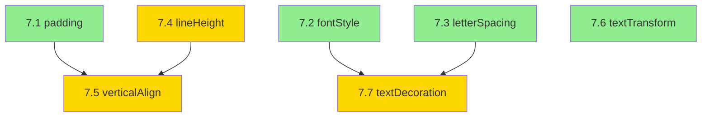

# P7 StylePanel ↔ Canvas 스타일 동기화 구현 계획

> **생성일**: 2025-12-13
> **목표**: StylePanel에서 설정한 CSS 속성이 Canvas에서 정확히 렌더링되도록 동기화
> **범위**: 9개 미구현/불일치 속성

---

## 현재 상태 분석

### 파일 구조

```
apps/builder/src/builder/workspace/canvas/sprites/
├── styleConverter.ts    # CSS → PixiJS 변환 (확장 필요)
├── BoxSprite.tsx        # 컨테이너 스프라이트 (padding 미구현)
├── TextSprite.tsx       # 텍스트 스프라이트 (padding 구현됨)
└── ImageSprite.tsx      # 이미지 스프라이트
```

### styleConverter.ts 현재 인터페이스

```typescript
// CSSStyle - 이미 정의됨 (lines 13-35)
export interface CSSStyle {
  // Transform
  left?, top?, width?, height?
  // Appearance
  backgroundColor?, borderRadius?, borderWidth?, borderColor?, borderStyle?, opacity?
  // Typography
  color?, fontSize?, fontWeight?, fontFamily?, textAlign?
  // Spacing
  padding?, paddingTop/Right/Bottom/Left?
  // Effects
  boxShadow?
}

// PixiTextStyle - 확장 필요 (lines 58-66)
export interface PixiTextStyle {
  fontFamily: string;
  fontSize: number;
  fontWeight: string;
  fill: number;
  align: 'left' | 'center' | 'right';
  wordWrap: boolean;
  wordWrapWidth: number;
  // 누락: fontStyle, letterSpacing, leading (lineHeight)
}
```

---

## 구현 계획

### Phase 7.1: BoxSprite padding 일관성 (P0 - Easy)

**목표**: TextSprite와 동일한 padding 로직을 BoxSprite에 추가

**현재 코드** (BoxSprite.tsx:84-86):
```typescript
// 텍스트 위치 (중앙 정렬)
const textX = transform.width / 2;
const textY = transform.height / 2;
```

**변경 계획**:
```typescript
// Padding 추출 (TextSprite 패턴 복제)
const paddingLeft = useMemo(() => {
  const p = style?.paddingLeft || style?.padding;
  return typeof p === 'number' ? p : parseInt(String(p) || '0', 10);
}, [style]);

const paddingTop = useMemo(() => {
  const p = style?.paddingTop || style?.padding;
  return typeof p === 'number' ? p : parseInt(String(p) || '0', 10);
}, [style]);

const paddingRight = useMemo(() => {
  const p = style?.paddingRight || style?.padding;
  return typeof p === 'number' ? p : parseInt(String(p) || '0', 10);
}, [style]);

const paddingBottom = useMemo(() => {
  const p = style?.paddingBottom || style?.padding;
  return typeof p === 'number' ? p : parseInt(String(p) || '0', 10);
}, [style]);

// 콘텐츠 영역 계산
const contentWidth = transform.width - paddingLeft - paddingRight;
const contentHeight = transform.height - paddingTop - paddingBottom;

// 텍스트 위치 (content 영역 중앙)
const textX = paddingLeft + contentWidth / 2;
const textY = paddingTop + contentHeight / 2;
```

**수정 파일**: `BoxSprite.tsx`

---

### Phase 7.2: fontStyle 구현 (P1 - Easy)

**목표**: italic, oblique 폰트 스타일 지원

**CSSStyle 확장** (styleConverter.ts):
```typescript
export interface CSSStyle {
  // 기존...
  fontStyle?: 'normal' | 'italic' | 'oblique';
}
```

**PixiTextStyle 확장**:
```typescript
export interface PixiTextStyle {
  // 기존...
  fontStyle: 'normal' | 'italic' | 'oblique';
}
```

**convertToTextStyle 수정**:
```typescript
export function convertToTextStyle(style: CSSStyle | undefined, containerWidth = 100): PixiTextStyle {
  return {
    // 기존...
    fontStyle: (style?.fontStyle as 'normal' | 'italic' | 'oblique') || 'normal',
  };
}
```

**BoxSprite/TextSprite TextStyle 수정**:
```typescript
const textStyle = useMemo(() => {
  return new TextStyle({
    // 기존...
    fontStyle: style?.fontStyle || 'normal',
  });
}, [style]);
```

**수정 파일**: `styleConverter.ts`, `BoxSprite.tsx`, `TextSprite.tsx`

---

### Phase 7.3: letterSpacing 구현 (P1 - Easy)

**목표**: 자간 설정 지원 (PixiJS 직접 지원)

**CSSStyle 확장**:
```typescript
export interface CSSStyle {
  letterSpacing?: number | string;
}
```

**PixiTextStyle 확장**:
```typescript
export interface PixiTextStyle {
  letterSpacing: number;
}
```

**convertToTextStyle 수정**:
```typescript
letterSpacing: parseCSSSize(style?.letterSpacing, undefined, 0),
```

**TextStyle 생성 수정**:
```typescript
new TextStyle({
  // 기존...
  letterSpacing: parseCSSSize(style?.letterSpacing, undefined, 0),
});
```

**수정 파일**: `styleConverter.ts`, `BoxSprite.tsx`, `TextSprite.tsx`

---

### Phase 7.4: lineHeight (leading) 구현 (P1 - Medium)

**목표**: 줄 간격 설정 지원

**PixiJS 참고**: PixiJS TextStyle에서 `leading` 속성으로 줄 간격 지원

**CSSStyle 확장**:
```typescript
export interface CSSStyle {
  lineHeight?: number | string;
}
```

**PixiTextStyle 확장**:
```typescript
export interface PixiTextStyle {
  leading: number;
}
```

**convertToTextStyle 수정**:
```typescript
// CSS lineHeight는 배수(1.5) 또는 픽셀(24px) 형태
// PixiJS leading은 픽셀 단위 추가 간격
const fontSize = parseCSSSize(style?.fontSize, undefined, 16);
const lineHeightValue = parseCSSSize(style?.lineHeight, undefined, 1.2);

// lineHeight가 1보다 크면 배수로 처리, 아니면 픽셀로 처리
let leading = 0;
if (typeof style?.lineHeight === 'string' && !style.lineHeight.includes('px')) {
  // 배수 (예: 1.5 → fontSize * 0.5 = leading)
  leading = fontSize * (lineHeightValue - 1);
} else {
  // 픽셀 (예: 24px → 24 - fontSize = leading)
  leading = Math.max(0, lineHeightValue - fontSize);
}

return {
  // 기존...
  leading,
};
```

**수정 파일**: `styleConverter.ts`, `BoxSprite.tsx`, `TextSprite.tsx`

---

### Phase 7.5: verticalAlign 구현 (P1 - Medium)

**목표**: 텍스트 수직 정렬 (top, middle, bottom)

**참고**: PixiJS에서 직접 지원하지 않음 → 수동 Y 위치 계산 필요

**CSSStyle 확장**:
```typescript
export interface CSSStyle {
  verticalAlign?: 'top' | 'middle' | 'bottom' | 'baseline';
}
```

**BoxSprite/TextSprite 수정**:
```typescript
// 텍스트 높이 측정 필요 (PixiJS Text.measureText 또는 BitmapFont.measureText)
const measureTextHeight = useCallback((text: string, style: TextStyle) => {
  // PixiJS TextMetrics 사용
  const metrics = TextMetrics.measureText(text, style);
  return metrics.height;
}, []);

// Y 위치 계산
const calculateTextY = (
  containerHeight: number,
  textHeight: number,
  verticalAlign: string,
  paddingTop: number,
  paddingBottom: number
): number => {
  const contentHeight = containerHeight - paddingTop - paddingBottom;

  switch (verticalAlign) {
    case 'top':
      return paddingTop;
    case 'middle':
      return paddingTop + (contentHeight - textHeight) / 2;
    case 'bottom':
      return containerHeight - paddingBottom - textHeight;
    default: // baseline
      return paddingTop;
  }
};

// anchor 수정 필요
// verticalAlign='top' → anchor.y = 0
// verticalAlign='middle' → anchor.y = 0.5
// verticalAlign='bottom' → anchor.y = 1
```

**수정 파일**: `BoxSprite.tsx`, `TextSprite.tsx`

---

### Phase 7.6: textTransform 구현 (P2 - Easy)

**목표**: 텍스트 대소문자 변환 (uppercase, lowercase, capitalize)

**CSSStyle 확장**:
```typescript
export interface CSSStyle {
  textTransform?: 'none' | 'uppercase' | 'lowercase' | 'capitalize';
}
```

**유틸리티 함수 추가** (styleConverter.ts):
```typescript
/**
 * CSS textTransform 적용
 */
export function applyTextTransform(text: string, transform: string | undefined): string {
  if (!transform || transform === 'none') return text;

  switch (transform) {
    case 'uppercase':
      return text.toUpperCase();
    case 'lowercase':
      return text.toLowerCase();
    case 'capitalize':
      return text.replace(/\b\w/g, char => char.toUpperCase());
    default:
      return text;
  }
}
```

**BoxSprite/TextSprite 수정**:
```typescript
import { applyTextTransform } from './styleConverter';

// 텍스트 내용 추출 후 변환
const textContent = useMemo(() => {
  const props = element.props as Record<string, unknown> | undefined;
  const content = props?.children || props?.text || props?.label;
  const rawText = content ? String(content) : '';
  return applyTextTransform(rawText, style?.textTransform);
}, [element.props, style?.textTransform]);
```

**수정 파일**: `styleConverter.ts`, `BoxSprite.tsx`, `TextSprite.tsx`

---

### Phase 7.7: textDecoration 구현 (P2 - Medium)

**목표**: 텍스트 장식 (underline, line-through, overline)

**참고**: PixiJS에서 직접 지원하지 않음 → Graphics로 선 그리기 필요

**CSSStyle 확장**:
```typescript
export interface CSSStyle {
  textDecoration?: 'none' | 'underline' | 'line-through' | 'overline';
}
```

**TextSprite 수정** (Graphics 추가):
```typescript
// 텍스트 장식 그리기
const drawTextDecoration = useCallback((g: PixiGraphics, textBounds: { x: number; y: number; width: number; height: number }) => {
  g.clear();

  const decoration = style?.textDecoration;
  if (!decoration || decoration === 'none') return;

  const textColor = cssColorToHex(style?.color, 0x000000);
  const lineWidth = Math.max(1, textStyle.fontSize / 12); // 폰트 크기에 비례

  g.setStrokeStyle({ width: lineWidth, color: textColor });

  switch (decoration) {
    case 'underline':
      const underlineY = textBounds.y + textBounds.height;
      g.moveTo(textBounds.x, underlineY);
      g.lineTo(textBounds.x + textBounds.width, underlineY);
      break;

    case 'line-through':
      const strikeY = textBounds.y + textBounds.height / 2;
      g.moveTo(textBounds.x, strikeY);
      g.lineTo(textBounds.x + textBounds.width, strikeY);
      break;

    case 'overline':
      const overlineY = textBounds.y;
      g.moveTo(textBounds.x, overlineY);
      g.lineTo(textBounds.x + textBounds.width, overlineY);
      break;
  }

  g.stroke();
}, [style?.textDecoration, style?.color, textStyle.fontSize]);

// JSX에 Graphics 추가
<pixiText ref={textRef} ... />
{style?.textDecoration && style.textDecoration !== 'none' && (
  <pixiGraphics draw={drawTextDecoration} />
)}
```

**수정 파일**: `TextSprite.tsx`, `BoxSprite.tsx`

---

## 구현 순서 및 의존성



**의존성**:
- 7.5 (verticalAlign)은 7.1 (padding)과 7.4 (lineHeight) 이후 구현
- 7.7 (textDecoration)은 7.2-7.4 이후 구현 (텍스트 bounds 정확히 필요)

---

## 테스트 계획

### 단위 테스트

```typescript
// styleConverter.test.ts

describe('applyTextTransform', () => {
  it('should uppercase text', () => {
    expect(applyTextTransform('hello', 'uppercase')).toBe('HELLO');
  });

  it('should lowercase text', () => {
    expect(applyTextTransform('HELLO', 'lowercase')).toBe('hello');
  });

  it('should capitalize text', () => {
    expect(applyTextTransform('hello world', 'capitalize')).toBe('Hello World');
  });
});

describe('convertToTextStyle', () => {
  it('should include fontStyle', () => {
    const result = convertToTextStyle({ fontStyle: 'italic' });
    expect(result.fontStyle).toBe('italic');
  });

  it('should calculate leading from lineHeight', () => {
    const result = convertToTextStyle({ fontSize: 16, lineHeight: '1.5' });
    expect(result.leading).toBe(8); // 16 * 0.5
  });
});
```

### 시각적 테스트 (Storybook)

각 속성에 대한 Storybook story 추가:
- `BoxSprite.stories.tsx`: padding, verticalAlign, textTransform, textDecoration
- `TextSprite.stories.tsx`: fontStyle, letterSpacing, lineHeight

---

## 커밋 전략

```bash
# 1. padding 수정
git commit -m "fix(canvas): add padding support to BoxSprite for consistency with TextSprite (P7.1)"

# 2. Typography 스타일 추가
git commit -m "feat(canvas): add fontStyle, letterSpacing, lineHeight to text rendering (P7.2-7.4)"

# 3. verticalAlign 추가
git commit -m "feat(canvas): add verticalAlign support for text positioning (P7.5)"

# 4. textTransform 추가
git commit -m "feat(canvas): add textTransform support for uppercase/lowercase/capitalize (P7.6)"

# 5. textDecoration 추가
git commit -m "feat(canvas): add textDecoration support with underline/line-through/overline (P7.7)"
```

---

## 예상 소요 시간

| Phase | 작업 | 난이도 | 예상 |
|-------|------|--------|------|
| 7.1 | padding (BoxSprite) | Easy | 15분 |
| 7.2 | fontStyle | Easy | 15분 |
| 7.3 | letterSpacing | Easy | 10분 |
| 7.4 | lineHeight | Medium | 30분 |
| 7.5 | verticalAlign | Medium | 45분 |
| 7.6 | textTransform | Easy | 15분 |
| 7.7 | textDecoration | Medium | 45분 |
| **Total** | | | **~3시간** |

---

## 후속 작업 (P7.8-7.9)

이번 계획에 포함하지 않은 항목:

- **7.8 flexWrap** (Hard): layoutCalculator.ts 전면 수정 필요
- **7.9 borderStyle** (Medium): dashed/dotted 커스텀 선 그리기 필요

이 항목들은 별도 계획으로 분리하여 진행 예정.
