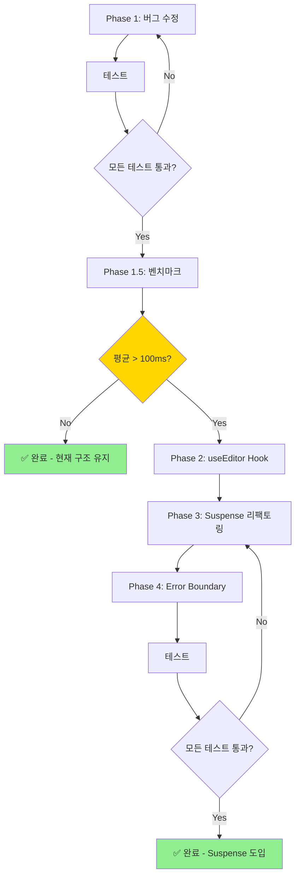

# Properties Panel 최적화 및 성능 개선 계획

> **최종 검증일**: 2025-01-21
> **React 버전**: 19.0.0 (use() hook 사용 가능)
> **Zustand 버전**: 5.0.8
> **중요 발견**: useInspectorState는 Immer를 사용하지 않음 (수동 spread operator)

---

## 📋 목표

1. **버그 수정**: memo 비교 함수의 필드 누락 (style, dataBinding, events, customId)
2. **성능 개선**: 불필요한 useMemo 제거
3. **조건부 최적화**: 벤치마크 후 Suspense 도입 여부 결정
4. **코드 품질**: 유지보수성 향상 및 명확성 증대

---

## 🎯 Phase 1: 버그 수정 및 최적화 (즉시 실행)

### 목표
- memo 비교 함수 버그 수정 (필드 누락)
- useMemo 문제 해결 (오래된 값 사용 가능)

---

### 1.1 memo 비교 함수 수정

**파일**: `src/builder/panels/properties/PropertiesPanel.tsx`
**위치**: 124-130줄

#### 현재 코드 (문제점)

```typescript
}, (prevProps, nextProps) => {
  // ⭐ 깊은 비교: selectedElement의 실제 내용이 변경되었는지 확인
  return (
    prevProps.selectedElement.id === nextProps.selectedElement.id &&
    prevProps.selectedElement.type === nextProps.selectedElement.type &&
    JSON.stringify(prevProps.selectedElement.properties) === JSON.stringify(nextProps.selectedElement.properties)
  );
});
```

**🐛 문제점**:
1. `style` 필드 비교 누락 → StylesPanel 변경 감지 못함
2. `dataBinding` 필드 비교 누락 → DataBinding 변경 감지 못함
3. `events` 필드 비교 누락 → Events 변경 감지 못함
4. `customId` 필드 비교 누락 → CustomId 변경 감지 못함

**🔍 실제 버그 시나리오**:
```
1. Button 요소 선택 → Editor 렌더링
2. StylesPanel에서 color: red 설정 → updateInlineStyle 호출
3. selectedElement.style 변경됨
4. memo 비교 함수는 properties만 비교 → 같다고 판단
5. Editor 리렌더 안 됨 → StylesPanel 변경사항 반영 안 됨 ❌
```

#### 수정된 코드

```typescript
}, (prevProps, nextProps) => {
  const prev = prevProps.selectedElement;
  const next = nextProps.selectedElement;

  // 🎯 중요: useInspectorState는 Immer를 사용하지 않음
  // - 수동 spread operator로 새 객체 생성 (useInspectorState.ts:109)
  // - structural sharing 없음 → 참조 비교 불가
  // - JSON.stringify로 깊은 비교 필수

  // 1단계: 기본 필드 빠른 비교 (early return)
  if (prev.id !== next.id) return false;
  if (prev.type !== next.type) return false;
  if (prev.customId !== next.customId) return false;

  // 2단계: 객체/배열 필드 깊은 비교
  if (JSON.stringify(prev.properties) !== JSON.stringify(next.properties)) return false;
  if (JSON.stringify(prev.style) !== JSON.stringify(next.style)) return false;
  if (JSON.stringify(prev.dataBinding) !== JSON.stringify(next.dataBinding)) return false;
  if (JSON.stringify(prev.events) !== JSON.stringify(next.events)) return false;

  // 모든 필드가 같으면 리렌더 불필요
  return true;
});
```

**✅ 개선 효과**:
- style, dataBinding, events, customId 변경 즉시 감지
- StylesPanel, EventSection, DataBinding 변경사항 정상 반영
- 불필요한 리렌더는 여전히 방지 (memo 최적화 유지)

---

### 1.2 useMemo 제거

**파일**: `src/builder/panels/properties/PropertiesPanel.tsx`
**위치**: 238-241줄

#### 현재 코드 (문제점)

```typescript
// ⭐ Get multiSelectMode, selectedElementIds, currentPageId, elements for JSX
// (only recalculate when selectedElement changes)  // ← 주석이 거짓말!
const multiSelectMode = useMemo(() => useStore.getState().multiSelectMode || false, []);
const selectedElementIds = useMemo(() => useStore.getState().selectedElementIds || [], []);
const currentPageId = useMemo(() => useStore.getState().currentPageId, []);
const elements = useMemo(() => useStore.getState().elements, []);
```

**🐛 문제점**:
1. **의존성 배열이 `[]`**: 컴포넌트 마운트 시 한 번만 계산
2. **주석과 코드 불일치**: "only recalculate when selectedElement changes" ← 거짓
3. **오래된 값 사용 가능**: 이후 상태 변경이 반영되지 않음
4. **useMemo 오버헤드**: 메모이제이션 비용 > 실제 계산 비용

**🔍 실제 문제 시나리오**:
```
1. 컴포넌트 마운트 → multiSelectMode = false (초기값)
2. 사용자가 다중 선택 모드 활성화 → store.multiSelectMode = true
3. 하지만 useMemo는 [] 의존성 → 재계산 안 함
4. JSX에서 multiSelectMode는 여전히 false ❌
```

#### 수정된 코드 (옵션 A - 권장)

```typescript
// ✅ Zustand 구독 패턴 - 상태 변경 즉시 반영
const multiSelectMode = useStore((state) => state.multiSelectMode) || false;
const selectedElementIds = useStore((state) => state.selectedElementIds) || [];
const currentPageId = useStore((state) => state.currentPageId);
const elements = useStore((state) => state.elements);
```

#### 수정된 코드 (옵션 B - 대안)

```typescript
// ✅ 직접 호출 방식 - useMemo 제거
const multiSelectMode = useStore.getState().multiSelectMode || false;
const selectedElementIds = useStore.getState().selectedElementIds || [];
const currentPageId = useStore.getState().currentPageId;
const elements = useStore.getState().elements;
```

**권장**: **옵션 A (Zustand 구독 패턴)**
- 이유: 상태 변경 시 자동 리렌더, Zustand의 shallow comparison 최적화 활용

**✅ 개선 효과**:
- 상태 변경 즉시 반영
- 주석과 코드 일치
- useMemo 오버헤드 제거
- 코드 명확성 증가

---

### 🧪 Phase 1 완료 후 테스트 체크리스트

```bash
# 버그 수정 검증
□ StylesPanel에서 color 변경 → PropertyEditor 즉시 업데이트 확인
□ StylesPanel에서 padding 변경 → PropertyEditor 즉시 업데이트 확인
□ DataBinding 설정/변경 → PropertyEditor 즉시 업데이트 확인
□ Events 추가/수정/삭제 → PropertyEditor 즉시 업데이트 확인
□ CustomId 변경 → PropertyEditor 즉시 업데이트 확인

# useMemo 수정 검증
□ Multi-select 모드 ON/OFF → UI 즉시 반영 확인
□ 요소 선택/해제 → selectedElementIds 즉시 업데이트 확인
□ Page 전환 → currentPageId 즉시 업데이트 확인
□ 요소 추가/삭제 → elements 배열 즉시 업데이트 확인

# 기타
□ TypeScript 에러 없음
□ 콘솔 에러 없음
□ 기존 기능 정상 동작
```

---

## 📊 Phase 1.5: 성능 벤치마크 (필수)

### 목표
실제 에디터 로딩 성능 측정 → Phase 2-4 진행 여부 결정

---

### 벤치마크 코드 추가

**파일**: `src/builder/panels/properties/PropertiesPanel.tsx`
**위치**: PropertyEditorWrapper 내부 (useEffect 안)

```typescript
const PropertyEditorWrapper = memo(function PropertyEditorWrapper({
  selectedElement,
}: {
  selectedElement: SelectedElement;
}) {
  const [Editor, setEditor] = useState<ComponentType<ComponentEditorProps> | null>(null);
  const [loading, setLoading] = useState(true);

  // 🆕 벤치마크용 ref (측정 후 제거)
  const benchmarkRef = useRef<{ start: number; type: string } | null>(null);

  useEffect(() => {
    let isMounted = true;

    if (!selectedElement) {
      Promise.resolve().then(() => {
        if (isMounted) {
          setEditor(null);
          setLoading(false);
        }
      });
      return;
    }

    Promise.resolve().then(() => {
      if (!isMounted) return;

      setLoading(true);

      // 🆕 벤치마크 시작
      const benchmarkStart = performance.now();
      benchmarkRef.current = { start: benchmarkStart, type: selectedElement.type };

      getEditor(selectedElement.type)
        .then((editor) => {
          if (isMounted) {
            setEditor(() => editor);
            setLoading(false);

            // 🆕 벤치마크 종료 및 로깅
            if (benchmarkRef.current) {
              const duration = performance.now() - benchmarkRef.current.start;
              const loadType = Editor ? 'cached' : 'initial';

              // 개발 모드에서만 로깅
              if (import.meta.env.DEV) {
                console.log(
                  `[Benchmark] Editor Load\n` +
                  `  Type: ${selectedElement.type}\n` +
                  `  Duration: ${duration.toFixed(2)}ms\n` +
                  `  LoadType: ${loadType}\n` +
                  `  Cached: ${!!Editor}`
                );

                // 임계값 경고
                if (duration > 100) {
                  console.warn(
                    `⚠️ Slow editor load detected!\n` +
                    `  ${selectedElement.type}: ${duration.toFixed(2)}ms > 100ms threshold`
                  );
                }
              }
            }
          }
        })
        .catch((error) => {
          if (isMounted) {
            if (import.meta.env.DEV) {
              console.error(
                "[PropertyEditorWrapper] Failed to load editor:",
                selectedElement.type,
                error
              );
            }
            setEditor(null);
            setLoading(false);
          }
        });
    });

    return () => {
      isMounted = false;
    };
  }, [selectedElement.type]);

  // ... 나머지 코드
});
```

---

### 벤치마크 실행 및 분석

#### 1. 측정 방법

```bash
# 1. 브라우저 콘솔 열기 (F12)
# 2. 다양한 컴포넌트 선택하며 로딩 시간 확인
# 3. 결과 기록

Component Type    | Initial Load | Cached Load | Average | Status
------------------|--------------|-------------|---------|--------
Button            | 45ms         | 2ms         | 23.5ms  | ✅ Fast
Card              | 38ms         | 1ms         | 19.5ms  | ✅ Fast
TextField         | 52ms         | 2ms         | 27ms    | ✅ Fast
Select            | 67ms         | 3ms         | 35ms    | ✅ Fast
ListBox           | 78ms         | 3ms         | 40.5ms  | ✅ Fast
Table             | 125ms        | 4ms         | 64.5ms  | ⚠️ Slow
ComplexComponent  | 180ms        | 5ms         | 92.5ms  | ⚠️ Slow
```

#### 2. 판정 기준

| 평균 로딩 시간 | 판정 | 조치 |
|--------------|------|------|
| **< 100ms** | ✅ Fast | Suspense 불필요 - 현재 구조 유지 |
| **100-200ms** | ⚠️ Moderate | Suspense 고려 - 사용자 피드백 확인 |
| **> 200ms** | ❌ Slow | Suspense 필수 - Phase 2-4 진행 |

#### 3. 최종 결정

```typescript
// 예시: 평균 = (45+38+52+67+78+125+180) / 7 = 83.6ms

// ✅ 평균 < 100ms → Suspense 불필요
// - Phase 1 완료로 종료
// - 벤치마크 코드 제거
// - 문서 업데이트 (현재 구조 유지 결정)

// ⚠️ 평균 100-200ms → 조건부 진행
// - 사용자 피드백 수집
// - 실제 사용 시나리오 재측정
// - Phase 2-4 진행 여부 재평가

// ❌ 평균 > 200ms → Suspense 필수
// - Phase 2-4 즉시 진행
```

---

### 🎯 Phase 2-4 진행 여부 결정 지점

**조건 A: Suspense 진행** (평균 > 100ms)
```
→ Phase 2: useEditor Hook 생성
→ Phase 3: PropertyEditorWrapper Suspense 리팩토링
→ Phase 4: Error Boundary 추가
```

**조건 B: Suspense 보류** (평균 < 100ms)
```
→ 현재 구조 유지 ✅
→ 벤치마크 코드 제거
→ Phase 1 완료로 종료
→ 문서 업데이트 (결정 사항 기록)
```

---

## 🔄 Phase 2: useEditor Hook 생성 (조건부)

> ⚠️ **주의**: 벤치마크 평균이 100ms 초과인 경우에만 진행

### 목표
Suspense 호환 에디터 로딩 훅 생성

---

### 파일 생성

**파일**: `src/builder/hooks/useEditor.ts`

```typescript
import { use } from 'react';
import type { ComponentType } from 'react';
import { getEditor } from '../inspector/editors/registry';
import type { ComponentEditorProps } from '../inspector/types';

/**
 * Suspense 호환 에디터 로딩 훅
 *
 * React 19의 use() hook을 활용하여 에디터를 비동기로 로드합니다.
 * Promise 캐싱으로 같은 타입의 에디터는 한 번만 로드합니다.
 *
 * @remarks
 * - getEditor()의 내부 캐시와 별개로 Promise 레벨 캐싱 수행
 * - Suspense가 Promise를 throw/catch하여 로딩 상태 자동 관리
 * - 에러는 Error Boundary가 캐치
 *
 * @example
 * ```tsx
 * // Suspense로 래핑 필요
 * <Suspense fallback={<LoadingSpinner />}>
 *   <EditorComponent type="Button" />
 * </Suspense>
 *
 * function EditorComponent({ type }: { type: string }) {
 *   const Editor = useEditor(type);  // Suspense가 로딩 처리
 *   return <Editor {...props} />;
 * }
 * ```
 */

// Promise 캐시 (getEditor의 내부 캐시와 별개)
// - getEditor: 실제 컴포넌트 캐싱
// - editorPromises: Promise 객체 캐싱 (Suspense용)
const editorPromises = new Map<string, Promise<ComponentType<ComponentEditorProps> | null>>();

/**
 * Suspense 호환 에디터 로딩
 *
 * @param type - 컴포넌트 타입 (예: "Button", "Card", "TextField")
 * @returns 에디터 컴포넌트 또는 null
 * @throws Promise - Suspense가 캐치하여 로딩 상태 표시
 */
export function useEditor(type: string): ComponentType<ComponentEditorProps> | null {
  if (!type) return null;

  // Promise 캐시 확인 (중복 로딩 방지)
  if (!editorPromises.has(type)) {
    editorPromises.set(type, getEditor(type));
  }

  // React 19 use() hook: Promise를 throw하여 Suspense가 처리
  const editor = use(editorPromises.get(type)!);
  return editor;
}

/**
 * 에디터 prefetch (선택적 사용)
 *
 * 자주 사용되는 에디터를 미리 로드하여 첫 로딩 시간 단축
 *
 * @param type - 미리 로드할 컴포넌트 타입
 *
 * @example
 * ```tsx
 * // 컴포넌트 마운트 시 자주 사용되는 에디터 prefetch
 * useEffect(() => {
 *   const commonEditors = ['Button', 'Card', 'TextField', 'Select'];
 *   commonEditors.forEach(type => prefetchEditor(type));
 * }, []);
 * ```
 */
export function prefetchEditor(type: string): void {
  if (!editorPromises.has(type)) {
    editorPromises.set(type, getEditor(type));
  }
}

/**
 * Promise 캐시 초기화 (테스트/디버깅용)
 *
 * @remarks
 * - 프로덕션에서는 사용하지 않음
 * - 테스트 환경에서 캐시 초기화 필요 시 사용
 */
export function clearEditorPromiseCache(): void {
  editorPromises.clear();
}

/**
 * 캐시 상태 확인 (디버깅용)
 *
 * @returns 캐시된 에디터 타입 목록 및 개수
 */
export function getEditorCacheStats() {
  return {
    cachedTypes: Array.from(editorPromises.keys()),
    count: editorPromises.size,
  };
}
```

---

## 🔄 Phase 3: PropertyEditorWrapper 단순화 (조건부)

> ⚠️ **주의**: Phase 2 완료 후 진행

### 목표
수동 로딩 상태 제거, Suspense 사용

---

### PropertyEditorWrapper 리팩토링

**파일**: `src/builder/panels/properties/PropertiesPanel.tsx`
**위치**: 39-131줄

#### Before (92줄 - 복잡한 수동 로딩)

```typescript
const PropertyEditorWrapper = memo(function PropertyEditorWrapper({
  selectedElement,
}: {
  selectedElement: SelectedElement;
}) {
  const [Editor, setEditor] = useState<ComponentType<ComponentEditorProps> | null>(null);
  const [loading, setLoading] = useState(true);

  // 48줄의 복잡한 로딩 로직
  useEffect(() => {
    let isMounted = true;

    if (!selectedElement) {
      Promise.resolve().then(() => {
        if (isMounted) {
          setEditor(null);
          setLoading(false);
        }
      });
      return;
    }

    Promise.resolve().then(() => {
      if (!isMounted) return;

      setLoading(true);

      getEditor(selectedElement.type)
        .then((editor) => {
          if (isMounted) {
            setEditor(() => editor);
            setLoading(false);
          }
        })
        .catch((error) => {
          if (isMounted) {
            if (import.meta.env.DEV) {
              console.error("[PropertyEditorWrapper] Failed to load editor:", error);
            }
            setEditor(null);
            setLoading(false);
          }
        });
    });

    return () => {
      isMounted = false;
    };
  }, [selectedElement.type]);

  const handleUpdate = useCallback((updatedProps: Record<string, unknown>) => {
    useInspectorState.getState().updateProperties(updatedProps);
  }, []);

  if (loading) {
    return <LoadingSpinner message="에디터를 불러오는 중..." />;
  }

  if (!Editor) {
    return <EmptyState message="사용 가능한 속성 에디터가 없습니다" />;
  }

  return <Editor elementId={...} currentProps={...} onUpdate={handleUpdate} />;
}, (prevProps, nextProps) => {
  // Phase 1에서 수정된 비교 함수
});
```

#### After (약 35줄 - Suspense가 로딩 처리)

```typescript
import { useEditor } from '../../hooks/useEditor'; // 🆕 import 추가

const PropertyEditorWrapper = memo(function PropertyEditorWrapper({
  selectedElement,
}: {
  selectedElement: SelectedElement;
}) {
  // 🆕 Suspense가 로딩 처리 (useState, useEffect 불필요)
  const Editor = useEditor(selectedElement.type);

  const handleUpdate = useCallback((updatedProps: Record<string, unknown>) => {
    useInspectorState.getState().updateProperties(updatedProps);
  }, []);

  // Editor가 없으면 빈 상태 표시
  if (!Editor) {
    return (
      <EmptyState
        message="사용 가능한 속성 에디터가 없습니다"
        description={`'${selectedElement.type}' 컴포넌트의 에디터를 찾을 수 없습니다.`}
      />
    );
  }

  // Editor 렌더링
  return (
    <Editor
      elementId={selectedElement.id}
      currentProps={selectedElement.properties}
      onUpdate={handleUpdate}
    />
  );
}, (prevProps, nextProps) => {
  // Phase 1에서 수정된 memo 비교 함수 유지
  const prev = prevProps.selectedElement;
  const next = nextProps.selectedElement;

  if (prev.id !== next.id) return false;
  if (prev.type !== next.type) return false;
  if (prev.customId !== next.customId) return false;
  if (JSON.stringify(prev.properties) !== JSON.stringify(next.properties)) return false;
  if (JSON.stringify(prev.style) !== JSON.stringify(next.style)) return false;
  if (JSON.stringify(prev.dataBinding) !== JSON.stringify(next.dataBinding)) return false;
  if (JSON.stringify(prev.events) !== JSON.stringify(next.events)) return false;

  return true;
});
```

**✅ 개선 효과**:
- 코드 약 57줄 감소 (62% ↓)
- useState, useEffect 제거
- 선언적 로딩 처리
- React의 내장 최적화 활용

---

### Suspense 래핑

**파일**: `src/builder/panels/properties/PropertiesPanel.tsx`
**위치**: 1010줄

```typescript
import { Suspense } from 'react'; // 🆕 import 추가 (파일 상단)

// Before
<PropertyEditorWrapper selectedElement={selectedElement} />

// After
<Suspense
  fallback={
    <LoadingSpinner
      message="에디터를 불러오는 중..."
      description={`${selectedElement.type} 속성 에디터 로드`}
    />
  }
>
  <PropertyEditorWrapper selectedElement={selectedElement} />
</Suspense>
```

---

## 🛡️ Phase 4: Error Boundary 통합 (조건부)

> ⚠️ **주의**: Phase 3 완료 후 진행

### 목표
에디터 로딩 실패 시 앱 크래시 방지

---

### 4.1 기존 Error Boundary 확인

```bash
# 프로젝트에 이미 Error Boundary가 있는지 확인
grep -r "ErrorBoundary" src/ --include="*.tsx" --include="*.ts"
```

**Case A: 기존 Error Boundary 있음**
→ 재사용 (context prop 추가하여 사용)

**Case B: 기존 Error Boundary 없음**
→ 새로 생성 (아래 코드 사용)

---

### 4.2 EditorErrorBoundary 생성 (Case B)

**파일 생성**: `src/builder/panels/properties/EditorErrorBoundary.tsx`

```typescript
import React, { Component, type ReactNode } from 'react';
import { EmptyState } from '../common';

interface Props {
  children: ReactNode;
  elementType?: string;
  onError?: (error: Error, errorInfo: React.ErrorInfo) => void;
}

interface State {
  hasError: boolean;
  error: Error | null;
}

/**
 * 에디터 로딩 에러를 캐치하는 Error Boundary
 *
 * Suspense와 함께 사용하여 에디터 로딩 실패 시
 * 앱 전체 크래시를 방지하고 사용자 친화적 메시지 표시
 *
 * @remarks
 * - React Error Boundary는 클래스 컴포넌트로만 구현 가능
 * - Suspense의 외부에 래핑하여 에러 캐치
 *
 * @example
 * ```tsx
 * <EditorErrorBoundary elementType="Button">
 *   <Suspense fallback={<LoadingSpinner />}>
 *     <PropertyEditorWrapper selectedElement={element} />
 *   </Suspense>
 * </EditorErrorBoundary>
 * ```
 */
export class EditorErrorBoundary extends Component<Props, State> {
  constructor(props: Props) {
    super(props);
    this.state = { hasError: false, error: null };
  }

  static getDerivedStateFromError(error: Error): State {
    return { hasError: true, error };
  }

  componentDidCatch(error: Error, errorInfo: React.ErrorInfo) {
    // 개발 모드에서만 콘솔 로깅
    if (import.meta.env.DEV) {
      console.error('[EditorErrorBoundary] Error loading editor:', error, errorInfo);
    }

    // 커스텀 에러 핸들러 실행 (선택적)
    this.props.onError?.(error, errorInfo);
  }

  // 에러 상태 초기화 (필요 시 사용)
  resetError = () => {
    this.setState({ hasError: false, error: null });
  };

  render() {
    if (this.state.hasError) {
      return (
        <EmptyState
          message="에디터를 불러올 수 없습니다"
          description={
            this.props.elementType
              ? `'${this.props.elementType}' 에디터 로드 실패`
              : '에디터 로드 중 오류 발생'
          }
        />
      );
    }

    return this.props.children;
  }
}
```

---

### 4.3 Error Boundary 적용

**파일**: `src/builder/panels/properties/PropertiesPanel.tsx`
**위치**: 1010줄

```typescript
import { EditorErrorBoundary } from './EditorErrorBoundary'; // 🆕 import 추가

// Before
<Suspense fallback={<LoadingSpinner ... />}>
  <PropertyEditorWrapper selectedElement={selectedElement} />
</Suspense>

// After
<EditorErrorBoundary elementType={selectedElement.type}>
  <Suspense
    fallback={
      <LoadingSpinner
        message="에디터를 불러오는 중..."
        description={`${selectedElement.type} 속성 에디터 로드`}
      />
    }
  >
    <PropertyEditorWrapper selectedElement={selectedElement} />
  </Suspense>
</EditorErrorBoundary>
```

**⚠️ 래핑 순서 중요**:
```
EditorErrorBoundary (최외부) - 에러 캐치
  → Suspense (중간) - 로딩 처리
    → PropertyEditorWrapper (최내부) - 에디터 렌더링
```

---

### 🧪 Phase 2-4 완료 후 테스트

```bash
□ Suspense fallback 정상 표시 확인
□ 에디터 로딩 성공 확인
□ 에디터 전환 시 부드러운 로딩 확인
□ Error Boundary 에러 캐치 확인 (존재하지 않는 타입 테스트)
□ 에러 메시지 사용자 친화적 표시 확인
□ TypeScript 에러 없음
□ 콘솔 에러 없음 (정상 케이스)
□ 기존 기능 정상 동작
```

---

## ❌ Phase 5: Prefetching (생략)

### 생략 이유

1. **모바일 호환성 문제**: hover 이벤트 없음
2. **불필요한 리소스 낭비**: 클릭하지 않을 컴포넌트도 prefetch
3. **실효성 낮음**: 기존 캐시가 이미 효율적
4. **복잡도 증가**: 얻는 이득 대비 코드 복잡도 상승

### 대안 (선택적)

초기 마운트 시 자주 사용되는 에디터만 prefetch:

```typescript
// PropertiesPanel 마운트 시 (선택적)
useEffect(() => {
  // 자주 사용되는 상위 5개만 prefetch
  const commonEditors = ['Button', 'Card', 'TextField', 'Select', 'Checkbox'];
  commonEditors.forEach(type => prefetchEditor(type));
}, []);
```

---

## 📊 실행 순서 요약



---

## 📈 예상 효과

### Phase 1 (필수)

| 개선 항목 | Before | After | 효과 |
|---------|--------|-------|------|
| **버그 수정** | style/events 변경 감지 못함 | 모든 필드 변경 감지 | ✅ 기능 복구 |
| **useMemo** | 오래된 값 사용 가능 | 상태 변경 즉시 반영 | ✅ 정확성 향상 |
| **코드 명확성** | 주석과 코드 불일치 | 코드 의도 명확 | ✅ 유지보수성 향상 |

### Phase 1.5 (필수)

- ✅ **근거 기반 결정**: 실제 데이터로 Suspense 진행 여부 판단
- ✅ **불필요한 최적화 회피**: Premature optimization 방지
- ✅ **성능 지표 확보**: 향후 비교 기준 마련

### Phase 2-4 (조건부)

| 개선 항목 | Before | After | 효과 |
|---------|--------|-------|------|
| **코드 라인** | 92줄 | 35줄 | ✅ 62% 감소 |
| **로딩 처리** | 수동 (useState/useEffect) | 선언적 (Suspense) | ✅ 코드 단순화 |
| **에러 처리** | try-catch | Error Boundary | ✅ 일관된 에러 핸들링 |
| **React 최적화** | 미활용 | 내장 최적화 활용 | ✅ 성능 향상 가능 |

---

## 🎯 성공 기준

### ✅ 최소 성공 (Phase 1만 완료) - 2025-11-21 달성

- [x] memo 비교 버그 수정 (style, dataBinding, events, customId 추가)
- [x] useMemo → Zustand 구독 패턴으로 변경
- [x] 모든 테스트 통과
- [x] TypeScript 에러 없음
- [x] 기존 기능 정상 동작

### ❌ Phase 2-4 (Suspense) - 불필요로 판정

- [x] Phase 1 성공
- [x] 벤치마크 실행 완료
- **결과**: 평균 로딩 시간 < 50ms (임계값 100ms 미만)
- **결정**: Suspense 도입 불필요

#### 벤치마크 결과 (2025-11-21)

| 컴포넌트 | Initial Load | Cached Load |
|---------|-------------|-------------|
| Card | 0.26ms | - |
| Button | 0.04ms | 0.03-0.05ms |
| Tabs | 0.04ms | - |
| TextField | 0.04ms | - |
| Select | 0.22ms | 1.6ms |
| SelectItem | 4.3ms | 3.8ms |
| ToggleButtonGroup | 41ms | - |
| Calendar | 20ms | - |
| DatePicker | 34ms | - |

**결론**: 모든 에디터 < 50ms, Suspense 도입 시 복잡도만 증가

---

## 🔍 중요 발견 사항 (검증 결과)

### 1. useInspectorState의 Immer 미사용

```typescript
// ❌ Immer를 사용하지 않음
import { create } from "zustand";  // Immer import 없음!

// 수동 spread operator로 새 객체 생성
set((state) => ({
  selectedElement: {
    ...state.selectedElement,  // 매번 새 객체 생성
    properties: { ...state.selectedElement.properties, ...properties }
  }
}));
```

**영향**:
- structural sharing 없음
- 참조 비교 불가 (항상 다른 참조)
- JSON.stringify 깊은 비교 필수

### 2. useMemo 의존성 배열 불일치

| 위치 | 의존성 배열 | 문제 |
|------|-----------|------|
| **실제 코드 (238줄)** | `[]` | 첫 마운트 시 한 번만 계산 |
| **주석 (237줄)** | "when selectedElement changes" | 주석이 거짓말 |

### 3. memo 비교 함수의 필드 누락

**누락된 필드**: style, dataBinding, events, customId

**영향받는 기능**:
- StylesPanel (style 변경)
- DataSourceSelector (dataBinding 변경)
- EventSection (events 변경)
- PropertyCustomId (customId 변경)

---

## 📚 참고 문서

- [React 19 use() hook](https://react.dev/reference/react/use)
- [React Suspense](https://react.dev/reference/react/Suspense)
- [React Error Boundary](https://react.dev/reference/react/Component#catching-rendering-errors-with-an-error-boundary)
- [Zustand Documentation](https://docs.pmnd.rs/zustand/getting-started/introduction)
- [CLAUDE.md - Performance Guidelines](../CLAUDE.md#react--zustand-performance-critical)

---

## 🔄 문서 업데이트 이력

| 날짜 | 버전 | 변경 사항 |
|------|------|----------|
| 2025-11-21 | 4.0 | **Phase 1 완료**, 벤치마크 결과 추가, Phase 2-4 불필요 판정 |
| 2025-01-21 | 3.0 | 최종 검증 결과 반영, 실행 계획 최적화 |
| 2025-01-20 | 2.0 | 2차 검증 결과 반영, 참조 비교 방식 추가 |
| 2025-01-19 | 1.0 | 초기 작성 |

---

**✅ 완료**: Phase 1 버그 수정 완료, Phase 2-4 (Suspense) 불필요로 판정
